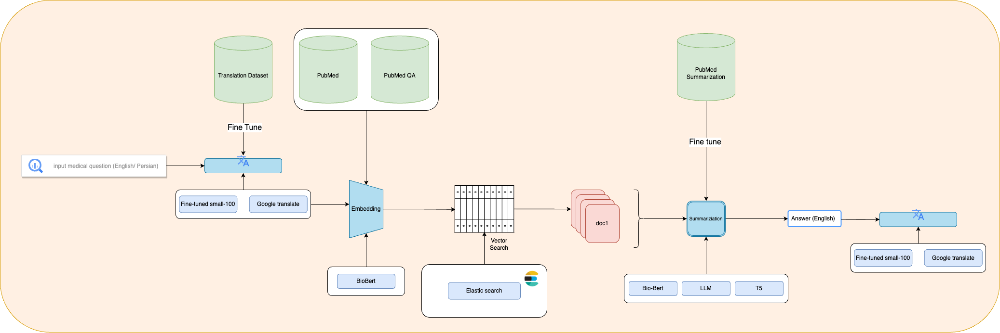

# MedDrug-QA

Dr. Asgari 

Sharif University of Technology - Spring 2023

Group 3 - Group 13

|Contributors|Student Number|Email|
| ------------- |:-------------:|:-------------:|
|Sina Abdous |400211495|sina.abdoos3@gmail.com‏|
|Hadis Ahmadiyan |400211524|Ahmadiyan.h.99@gmail.com‏|
|Sara Azarnoush |98170668|azarnooshsa@gmail.com|
|Mohammadreza Daviran |98101566|mohammadreza.dn80@gmail.com‏|
|Nona Ghazizadeh |98171007|nonaaghazizadeh@gmail.com‏|
|Mahsa Yazdani |400200892|mah.yzdni@gmail.com|

## Pipeline

In this project, we provided a model for the Persian/English medical question-answering task using PubMed datasets.

[Code](https://github.com/NLP-Final-Projects/Drug-QA/blob/main/Codes/Final%20Pipeline/NLP_Final_Project.ipynb)

[Work Flow](https://github.com/NLP-Final-Projects/Drug-QA/blob/main/Codes/Final%20Pipeline/Final_nlp_workflow.ipynb)

[Paper](https://github.com/NLP-Final-Projects/Drug-QA/blob/main/Documents/Report/NLP_Project_Report.pdf)

[Web Interface](https://5trhfplmpabp227m.anvil.app/BD2EV5NDYAY64VR3HQAK56DB)

## Table of Contents

- [Documents](https://github.com/NLP-Final-Projects/Drug-QA/tree/main/Documents)
  - [Proposal](https://github.com/NLP-Final-Projects/Drug-QA/blob/main/Documents/Final%20Project%20Proposal-G3-G13.pdf)
  - [Slide](https://github.com/NLP-Final-Projects/Drug-QA/blob/main/Documents/Report/NLP_Project_Slides.pdf)
  - [Drug Text](https://github.com/NLP-Final-Projects/Drug-QA/blob/main/Documents/drug-text.drawio)
  - [Drug Generation](https://github.com/NLP-Final-Projects/Drug-QA/blob/main/Documents/drug%20generation.docx)
  - [Drug Recommendation](https://github.com/NLP-Final-Projects/Drug-QA/blob/main/Documents/drug%20_recommendation.drawio)
  
- Data
  - [PubMed QA Main](https://huggingface.co/datasets/viewer/?dataset=pubmed_qa&config=pqa_labeled)
  - [PubMed Main](https://pubmed.ncbi.nlm.nih.gov/)
  - [PubMed QA Processed](https://drive.google.com/drive/folders/1Xkp4b-tpQGZE-c3LIkTKYsX6kmRp3WNL?usp=drive_link)
  - [PubMed Processed](https://drive.google.com/drive/folders/1_2wLirvCbRosGrBZ43ANOD6rCSwKnkX2?usp=drive_link)
 
- [Preparing Data](https://github.com/NLP-Final-Projects/Drug-QA/tree/main/Codes/Preparing%20Data)
  - [pubmed_qa](https://github.com/NLP-Final-Projects/Drug-QA/blob/main/Codes/Preparing%20Data/preparing_pubmed_qa_data.ipynb)
  - [pubmed](https://github.com/NLP-Final-Projects/Drug-QA/blob/main/Codes/Preparing%20Data/preparing_pubmed_data.ipynb)
    
- [Translation](https://github.com/NLP-Final-Projects/Drug-QA/tree/main/Codes/Translation)
  - [Crawler](https://github.com/NLP-Final-Projects/Drug-QA/tree/main/Codes/Translation/Crawler)
  - [Dataset](https://github.com/NLP-Final-Projects/Drug-QA/tree/main/Codes/Translation/Datasets)
  - [English to Persian](https://github.com/NLP-Final-Projects/Drug-QA/blob/main/Codes/Translation/Notebooks/fine-tune-en-fa-small100.ipynb)
  - [Persian to English](https://github.com/NLP-Final-Projects/Drug-QA/blob/main/Codes/Translation/Notebooks/fine-tune-fa-en-small100.ipynb)
 
- [Embedding - Vector Search]()
  - [Embedding](https://github.com/NLP-Final-Projects/Drug-QA/blob/main/Codes/Embedding-Search/NLP_Project_Embedding.ipynb)
  - [Vector Search](https://github.com/NLP-Final-Projects/Drug-QA/blob/main/Codes/Embedding-Search/Vector_Search.ipynb)

- [Summarization](https://github.com/NLP-Final-Projects/Drug-QA/tree/main/Codes/Summarization/notebooks)
  - [Falcon](https://github.com/NLP-Final-Projects/Drug-QA/blob/main/Codes/Summarization/notebooks/Falcon_7B_medical_summarization.ipynb)
  - [GPT](https://github.com/NLP-Final-Projects/Drug-QA/blob/main/Codes/Summarization/notebooks/GPT_API_Summarizer.ipynb)
  - [BioBert](https://github.com/NLP-Final-Projects/Drug-QA/blob/main/Codes/Summarization/notebooks/BioBart-fine-tune.ipynb)
  - [T5](https://github.com/NLP-Final-Projects/Drug-QA/blob/main/Codes/Summarization/notebooks/T5-fine-tune.ipynb)
 
- Hugging face
  - [English to Persia](https://huggingface.co/thisishadis/model_en_fa)
  - [Persia to English](https://huggingface.co/thisishadis/model_fa_en)
  - [BioBart on pubmed](https://huggingface.co/thisishadis/BioBart_on_pubmed)
  - [T5 on pubmed](https://huggingface.co/thisishadis/T5_on_pubmed)

 

